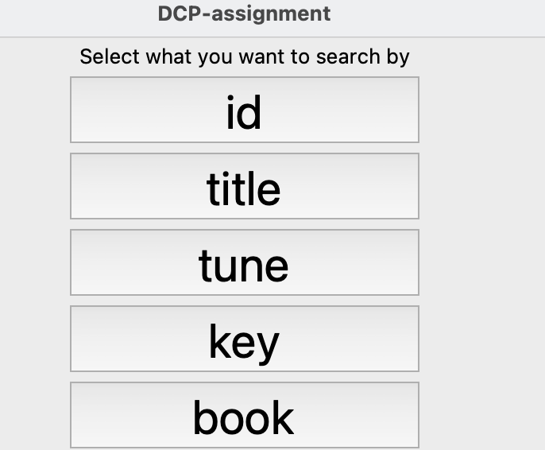
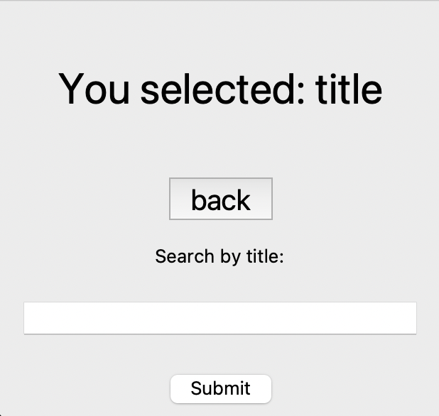
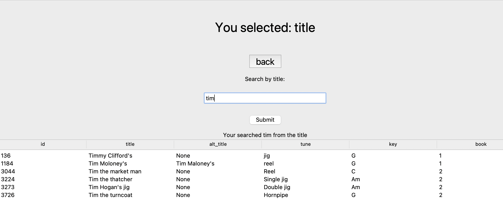
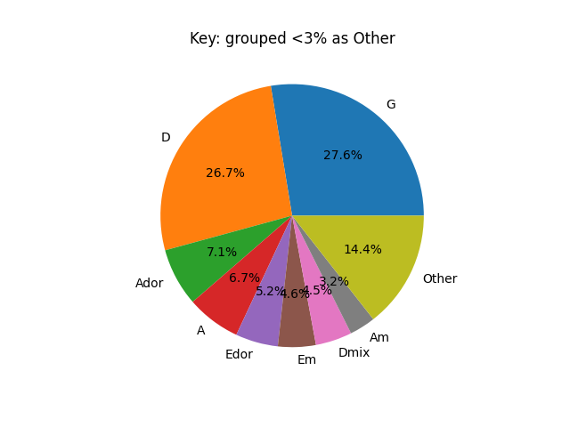
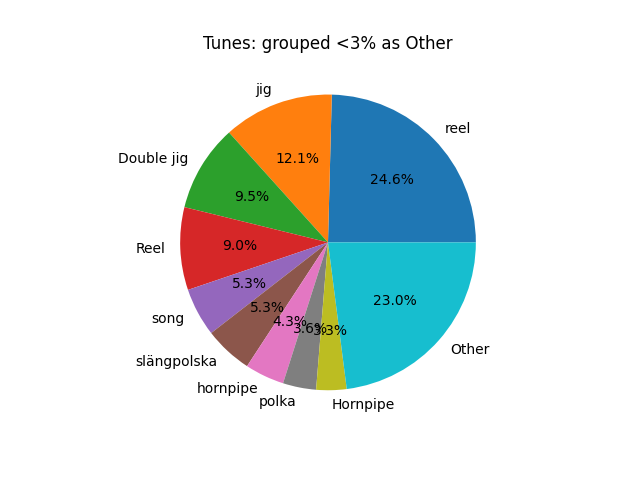
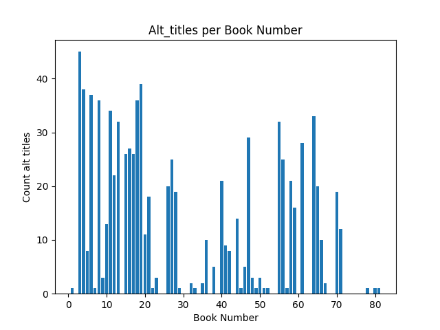

# Data Centric Programming Assignment 2025

- [Assignment Brief](assignment.md)

Name: Dillon Thornton

Student Number: C24452624

# Screenshots

# Description of the project
This project goes through abc files and puts the data into SQL database, code can then be interacted with using tkinker or made into graphs using matplotLIB
# Instructions for use
- Run the data.py file to insert the code into database
- Run the visual.py file to run matplotlib with images of bar and pie charts to be saved into the images file
- Run GUI to search for data by id,title,tune,key or book
# How it works:
- The data.py thanks in all the data from the .abc files cleans it, and inserts it into tune.db. For everytime a line starts with X: it isnserts it into a list and then appends it to another list after the function is over. It repeats this proecess with each file in the directory. That data is then cleaned so no id can be none and each tune must have a title, duplicates are then gotten rid of and each row is give a new unique index. It also replaces the mojibake (garbled text) with what type of letter its supposed to be.

- The visual.py file is all letting the user interact with the stats of the file, running this file will save bar charts and pie charts visualising the data in the images fold

- gui.py is an interface the users can interact with to see what the data is in the file, before seaching the user willl be prompted to select a button that filters their search into the categories of the column names, the can the search for the data and if the contiditions are met a table will display of the results of their search hopefully allowing them to find the information they had been looking for
- project.py is what i orginally had before loading using a database or ttkiner, the ui is in the terminal but has some unique features
# List of files in the project

| Files | Source |
|-----------|-----------|
| gui.py | Self written (modiefied with chatGPT) |
| visual.py |Self written |
| data.py | Self written Modified with ChatGpt |
| project.py | Self written file with UI in the terminal |
|images|All the matplotLib images|

# References
* https://www.youtube.com/watch?v=lyoyTlltFVU&t=348s
* https://www.youtube.com/watch?v=TuLxsvK4svQ&t=8398s
* ChatGPT

# What I am most proud of in the assignment

I am most proud of using the tkinter interface to make a GUI, to make it go from mutiple pages was quit challenging and i need to look at youtube videos to help me with some of the design emlements, I feel as if i had good code reusablity with my use of functions in this part of the assignment as well

# What I learned
I learned how to use the OS to naigate file directories, tkinter to have a gui and mathplotLib to make charts, these where all new concepts that id never done be for and learning how to use each of these modules proved challenging but was quiet fun

# MatplotLIB Charts

All Book chart are meant to be each indivdual file not book number

